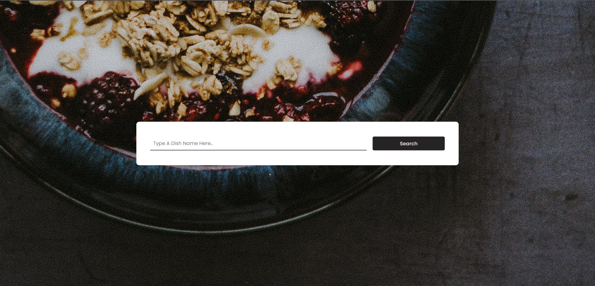
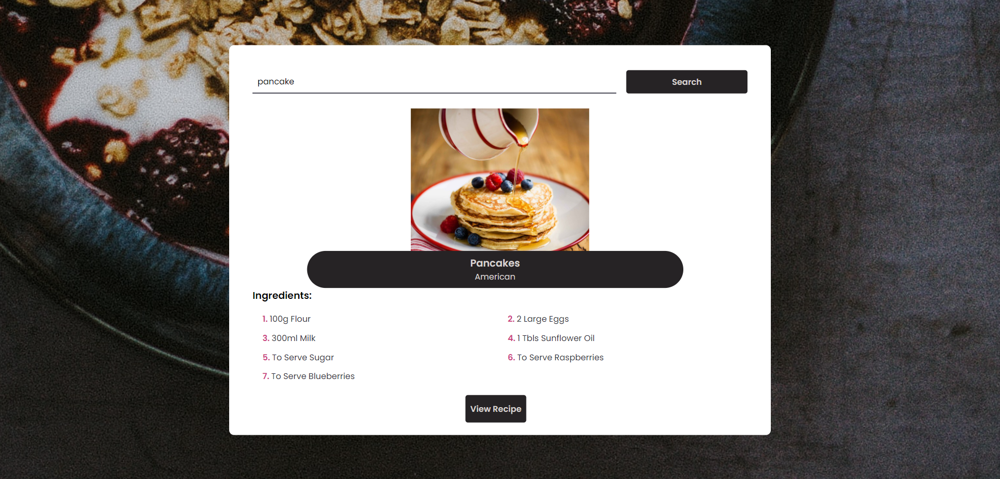
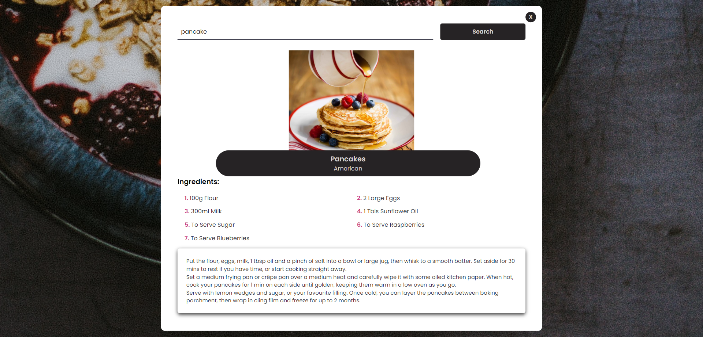

# Recipe Search Web Application
This is a simple web application that allows users to search for recipes by entering the name of a dish. The application fetches recipe data from the TheMealDB API and displays the recipe details along with the ingredients and cooking instructions.

- <b>Website link : </b>[Click here✨](https://blaze-001.github.io/Recipe-Search-Web-Application/)
### Technologies Used
* HTML
* CSS
* JavaScript
### Usage
1. In the search box, type the name of the dish you want to search for.
2. Click the "Search" button to fetch and display the recipe.
3. The application will display the dish's image, name, and area (origin).
4. The list of ingredients and their corresponding measurements will be shown.
5. Click on the "View Recipe" button to reveal the cooking instructions.
6. Click the "X" button inside the recipe box to hide the instructions.

### Screenshots
#### Home Page

#### Search Results

#### Recipe Details

